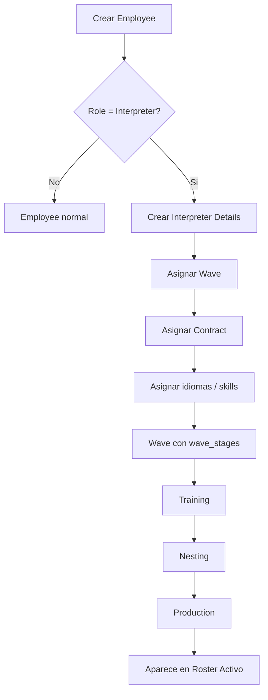

# Workflow ideal de interpreters y waves

## Objetivo

Separar correctamente:

- la creacion del `employee`
- la habilitacion del employee como `interpreter`
- la asignacion a una `wave`
- el avance por `wave_stages`

La idea es que el roster solo muestre interpretes que ya esten operativos:

- tengan `interpreter_details`
- tengan `wave_id`
- y esten vinculados a una wave valida con stages definidos

## Entidades y responsabilidad

### `employees`

Entidad base de la persona.

- se crea primero
- puede tener cualquier rol
- si `role_id = 1`, entonces puede convertirse en interpreter

### `interpreter_details`

Perfil operativo del interpreter.

- enlaza el employee con una wave
- guarda `contract_id`
- guarda fechas operativas
- es el registro que habilita al interpreter para el roster

### `waves`

Contenedor de la cohorte o campana operativa.

- agrupa interpretes
- define el ciclo de trabajo
- no deberia mezclarse con la creacion base del employee

### `wave_stages`

Define el calendario y las fases de la wave.

- `TRAINING`
- `NESTING`
- `PRODUCTION`

Cada stage tiene:

- `start_date`
- `end_date`

Esta tabla es el motor temporal del workflow.

## Workflow recomendado

## Participacion de `wave_stages`

`wave_stages` representa el plan maestro de la wave.

### Funciones principales

- define la secuencia de fases
- define fechas de inicio y fin por fase
- permite calcular en que etapa esta la wave hoy
- permite inferir la etapa actual de los interpretes asignados

### Uso recomendado

- `waves` define la cohorte
- `wave_stages` define el avance temporal
- `interpreter_details` define la asignacion individual

## Regla de negocio para el roster

Un interpreter solo debe aparecer en el roster si cumple todo esto:

- tiene `role_id = 1`
- tiene `interpreter_details`
- `interpreter_details.wave_id` no es nulo
- la wave existe
- idealmente la wave tiene `wave_stages`

## Fase actual

La fase actual se puede calcular a partir de `wave_stages`.

Ejemplo:

- si la fecha actual cae dentro de `TRAINING`, el interpreter esta en training
- si cae dentro de `NESTING`, esta en nesting
- si cae dentro de `PRODUCTION`, esta en production

## Recomendacion de backend

### Crear employee

- `POST /api/employees`

### Crear setup del interpreter

- `POST /api/interpreters/{interpreterId}/setup`

### Consultar roster

- `GET /api/interpreters`
- devuelve solo interpretes con details y wave asignada

### Manejo de waves

- crear wave
- crear `wave_stages`
- asignar interpretes a la wave
- calcular la fase actual desde `wave_stages`

## Recomendacion de modelo

### Fuente de verdad

- `wave_stages` es la fuente de verdad del calendario
- `interpreter_details` es la fuente de verdad de la asignacion individual

### No recomendado

- duplicar manualmente el estado de la wave en muchos lugares
- mostrar interpretes sin wave asignada en el roster activo

## Resumen

- `employees` crea la persona
- `interpreter_details` activa el rol operativo de interpreter
- `waves` agrupa la operacion
- `wave_stages` define el ciclo temporal de esa operacion
- el roster debe mostrar solo interpretes ya listos para operar
